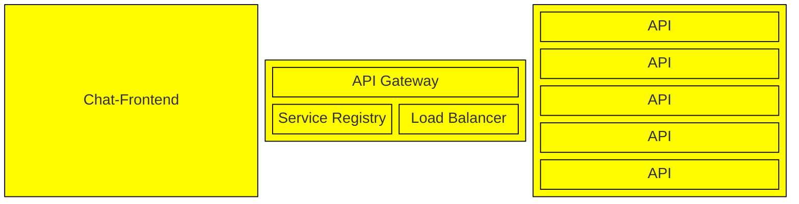

# About

```mermaid
block-beta
columns 3
  A1["Chat-Frontend"]
  block:B
    columns 2
    B1["API Gateway"]:2
    B2["Service Registry"]
    B3["Load Balancer"]
  end
  block:C
    columns 1
    C1["API"]
    C2["API"]
    C3["API"]
    C4["API"]
    C5["API"]
  end
  classDef default fill:#fffc00,stroke:#000000,stroke-width:1px
```