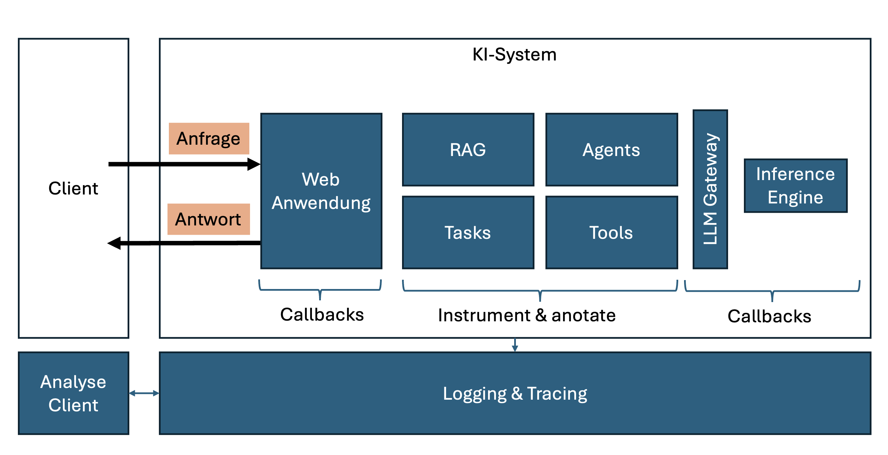

# Observability

Observability von künstlicher Intelligenz ist ein Konzept, das die Fähigkeit beschreibt, die Aktionen von KI-Systemen in realen Umgebungen zu überwachen und zu verstehen.

Ziele von Observability sind:

- Grundlegende Probleme identifizieren
- Qualitäts und Leistung kontinuierlich überwachen und verbessern

Dazu ist es wichtig kontinuierlich Daten zu sammeln und zu analysieren:

- Eingaben (Request)
- Ausgaben (Response)

Dabei ist es relevant nicht nur Eingabe uns Ausgabe zu loggen, sondern auch den internen Status von KI-Systemen zu überwachen und damit zu verstehen wie die Eingabe in die Ausgabe vom KI-System transformiert wird.

Grundsätzlich werden folgende Daten unterschieden:

- Metriken
- Logging-Einträge
- Traces

Aktuell gibt es zwei Ansätze in der Observability. Der erste fokussiert auf das Überwachen eines Systems in der Produktivumgebung. Der zweite fokussiert auf die Entwicklung und die Aufrechterhaltung eines KI Use Cases.

|Fokus| KI-System | KI Use Case |
|-----| --------- | ----------- |
|Traces|||
|Metriken|||
|Fehler| zur Laufzeit| Ex-Post (Evaluation, User Feddback)|
|Anwendungsfälle| Durchsatz & Latenz | Debug Traces, Anwendungs-Benchmarking, Testen, Monitor Halluzinationen, Evaluierung |
|Rollem| DevOps | Data Scientist, Softwareentwickler|
|Fokus| holistischer Blick auf das System | KI Use Case verstehen |

Ziel ist es einen Observability Stack bereitzustellen, den alle wesentlichen Komponenten der KI Referenzarchitektur nutzen: Frontend, Services, LLM-Gateway und Inference Engines. Dabei werden Instrumentalisierung, Annotation (Dekoration) und Callbacks genutzt.  

## OpenTelemetry

[OpenTelemetry](https://opentelemetry.io) ist ein open source Initiative, die eine Sammlung von APIs, SDKs und tools bereitstellt, um standardisiert zielgerichtete Observability zu ermöglichen.

Damit können dann Telemetrie Daten (Logs, Metriken, Traces) instrumentarisiert, erzeugt, gesammelt und exportiert werden, um die Performanz und das Verhalten von Software zu analysieren.

Aktuell ist ein Projekt in Gange, das innerhalb von OpenTelemetrie  [Generative AI Observability](https://github.com/open-telemetry/community/blob/main/projects/gen-ai.md) ermöglichen soll.

## Typische KI Observability Tools

- [Langfuse](https://langfuse.com)
- [Pydantic Logfire](https://logfire.pydantic.dev/docs/)
