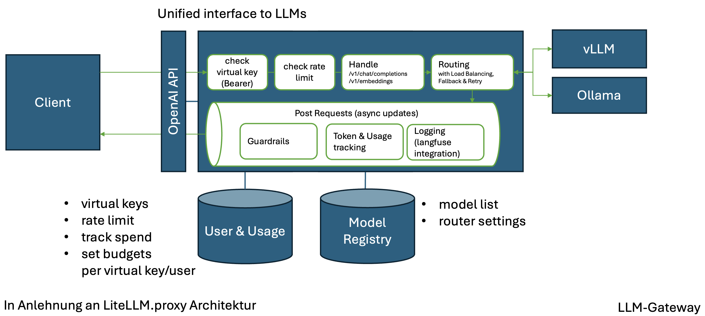

# LLM-Gateway

Das LLM-Gateway liefert eine einheitliche Schnittstelle zu LLMs. Es unterstützt das [OpenAI API](https://platform.openai.com/docs/overview) und erfüllt folgende Aufgaben innerhalb der Plattform.

## Anforderungen:

- zu Verfügungstellung der OpenAI API /v1/chat/completions und /v1/embedding für Chat und Vector-Embeddings.
- Routing der Anfragen auf verschiedene On-Premise Inference Backends (Inference Engines) oder öffentliche Modell Anbieter.
- Load Balancing
- Verwaltung von Berechtigungen auf Organisation, Team und Benutzer-Ebene für die Nutzung von Modellen.
- Autorisierung (darf Modell vom Anfragenden Client genutzt werden?)
- Tracking des Token-Verbrauchs bzw. der Kosten: sowohl der Input- als auch der Output-Tokens.
- Überprüfen von Rate Limits (request per minute, tokens per minute)
- Callbacks (Anbindung von LLM-Engineering Plattformen, wie z.B. Langfuse)
- Logging: Anbindung von Log-Providern
- Post-Processing (zur Integration von z.B. Guardrails)
- Streaming und Unterstützung für asynchrone Anfragen
- Fehler-Management mittels Fallbacks: Automatischer Retry, ...  

## Architektur

## Kandidaten für eine Implementierung

**[LiteLLM.proxy](https://docs.litellm.ai/docs/simple_proxy)**
