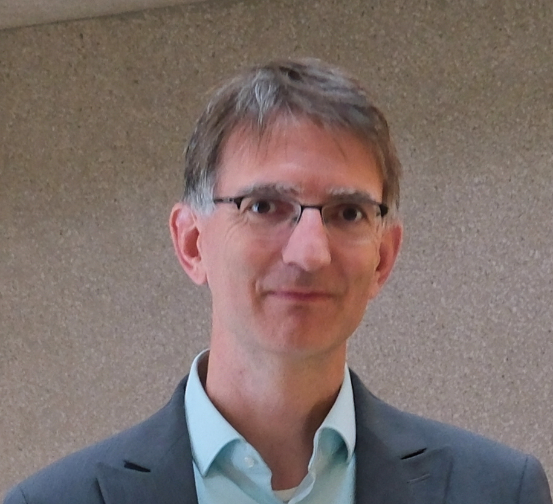

# Über die Autoren

|Autor|Verantwortungsbereich||Kontaktinformation|
|-----|---------------------||------------------|
|{width=100 height=100}|Dr. Michael Wissen, CTO - IT-Koordination, Innenministerium Baden-Württemberg | Dr. Michael Wissen ist CTO und Verantwortlicher für die IT-Koordination im Ministerium des Inneren, für Digitalisierung und Kommunen Baden-Württemberg. Seit Dezember 2017 bringt er umfassende Expertise und innovative Ansätze in die digitale Transformation des Landes ein. In seiner Rolle als Architekt der KI4BW-Initiative spielt Dr. Wissen eine entscheidende Rolle bei der Entwicklung und Implementierung von Künstlicher Intelligenz (KI) innerhalb des öffentlichen Sektors. Er ist maßgeblich daran beteiligt, strategische Rahmenbedingungen zu schaffen und innovative KI-Lösungen zu gestalten, die darauf abzielen, Prozesse zu optimieren und interaktive Dienstleistungen für die Bürger zu verbessern. Zuvor war Dr. Wissen über 9 Jahre in der BARMER tätig, wo er u.a. Leiter des Architekturmanagements wertvolle Erfahrungen in der strategischen Planung und dem IT-Management sammelte.|--|
|{width=100 height=100}|Dr. Kathrin Schumacher, Referentin IT-Koordination, Innenministerium Baden-Württemberg|Dr. Kathrin Schumacher ist Referentin für IT-Koordination im Innenministerium Baden-Württemberg und engagiert sich aktiv in der Förderung von Künstlicher Intelligenz (KI) im öffentlichen Sektor. Seit Mai 2023 bringt sie wertvolle Expertise in die digitale Transformation des Landes ein. Als Projektleiterin für das Vorhaben #KI4BW ist sie maßgeblich für die Entwicklung und Umsetzung von KI-Initiativen zuständig. In diesem Zusammenhang präsentierte sie das Projekt auch beim IT-Planungsrat und betonte die Bedeutung von Kooperation und Austausch in der KI-Entwicklung. Zuvor war sie über acht Jahre als akademische Mitarbeiterin an der Universität Stuttgart tätig, wo sie im Graduiertenkolleg „GSaME“ forschte und ihre Dissertation abschloss|--|
|{width=100 height=100}|Dominik Neumann, Senior Lösungs-Architekt im Bereich Public, Partner bei <a href="https://www.exxeta.com"> Exxeta </a>|Mit mehr als 30 Jahren Erfahrung in verschiedenen IT-Rollen - als Software-Architekt, Transformations-Experte und Business-Manager - hat Dominik Neumann besondere Erfahrung als Enterprise-Architekt in der Data- und Business-Driven IT Modernisierung & IT-Strategie. Er ist Berater und Data Scientist in Modernisierungsprojekten mit Fokus auf dem Alignement zwischen organisationalem Schnitt und Architektur. Seine Schwerpunkte liegen im Bereich der Analyse großer monolithischer Systeme und Anwendungslandschaften, in der Ableitung von Strategien und Maßnahmen zur fachlichen und technologischen Modernisierung, sowie in der Identifikation und Implementierung notwendiger Veränderungen.|Kontaktaufnahme gerne via <a href="https://www.linkedin.com/in/dominik-neumann/"> LinkedIn </a>|
|{width=100 height=100}|Tobias Häusser, Senior Programmleiter im Bereich Public bei <a href="https://www.exxeta.com"> Exxeta </a>|Tobias Häusser bringt über 20 Jahre Erfahrung im IT-Produktmanagement und Projektmanagement mit, insbesondere im öffentlichen Dienst. Seine Stationen umfassen Schlüsselpositionen bei dem Deutschen Sparkassenverlag, adesso und der IT-Behörde des Landes Baden-Württemberg. Bereits 2011 forschte er im EU-Projekt FIRST, wo er unstrukturierte Finanzmarktdaten analysierte. Diese Erfahrungen flossen ein in die Veröffentlichung des Papers "Extracting Investor Sentiment from Weblog Texts: A Knowledge-based Approach." Tobias ist diplomierter Informatiker und Experten in Softwarearchitektur, der innovative Lösungen für die digitale Transformation im öffentlichen Sektor entwickelt.|Kontaktaufnahme gerne via <a href="https://www.linkedin.com/in/tobias-haeusser/"> LinkedIn </a>|
