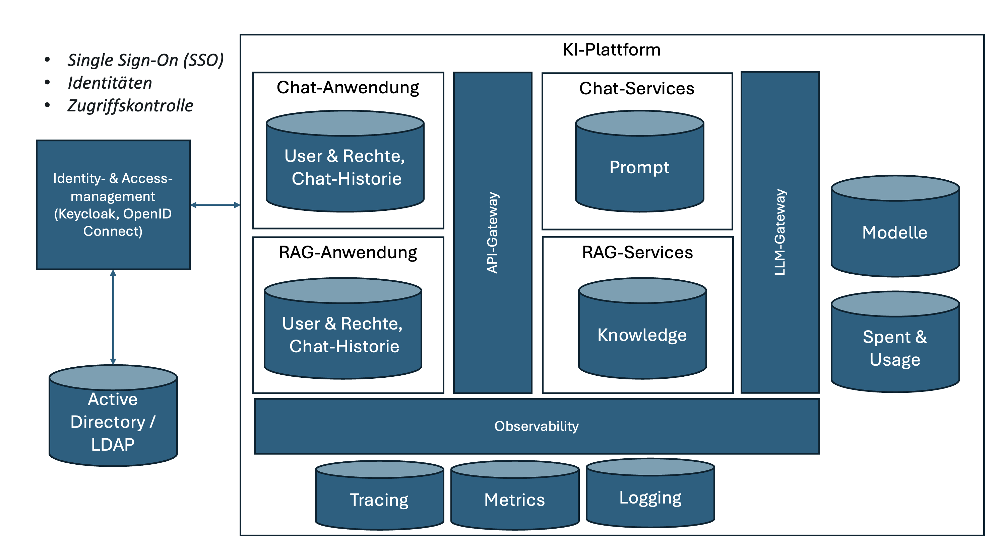

# Datenmanagement

Eine Implementierung unter Zuhilfenahme von Open-Source-Komponenten, setzt ein föderiertes Datenmanagement voraus.

Das Datenmanagement umfasst dabei auf folgende Aspekte:

- User Management
- Berechtigungskonzept
- Authentifizierung
- Chatverlauf
- Prompt-Verwaltung
- Wissensbasis für RAG
- Modell-Repository & Registry
- Token-Verbrauchs & Spent-Management
- Modell-Berechtigungen
- Logging und Tracing-Daten

## Identity & Access-Management

## Fachliches Datenmodell

Diesem liegt ein fachliches Datenmodell zugrunde:
