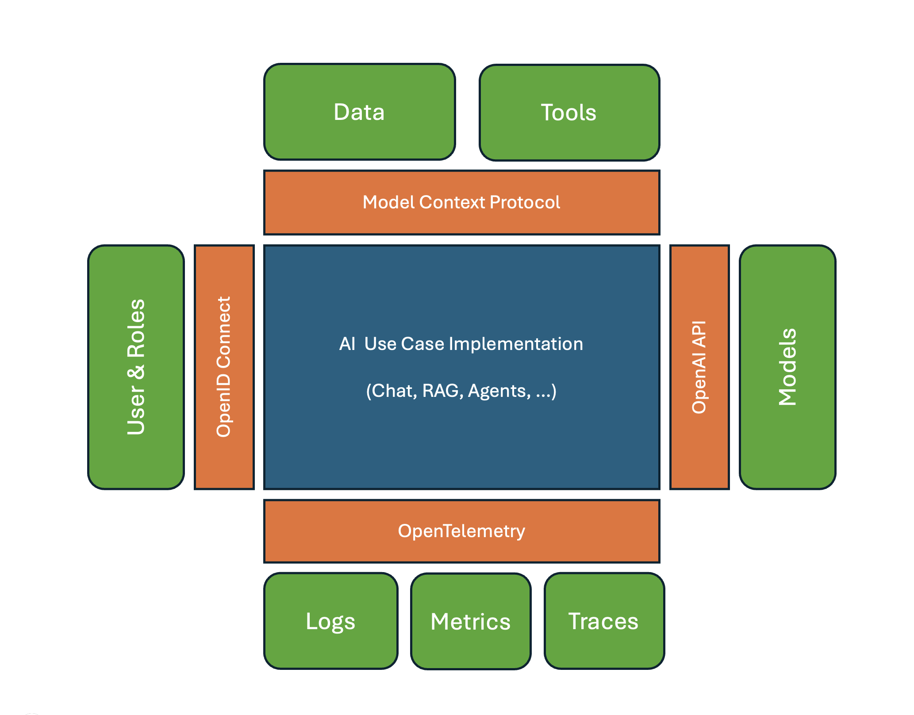

# High-Level-Architektur

Folgende Darstellung zeigt die High-Level-Referenzarchitektur in 3 Schichten (Layer), die untenstehend näher beschrieben werden.

## Offene Standards

Die (Referenz-)implementierung sollte so gestaltet werden, dass alle Komponenten cloud-nativ auf einem Kubernetes-Cluster betrieben werden können.

Die vier wichtigsten offenen Standards, sind OpenAI API, Model Context Protocol, OpenID Connect und OpenTelemetry:

- OpenAI API kapselt das Inference Backend und die Modelle,
- Model Context Protocol abstrahiert den Tool- und Datenzugriff über MCP Server,
- OpenID Connect sorgt für Authentifizierung und liefert beispielsweise über einen Keycloak User und Rolle,
- OpenTelemetry ist ein offener Standard für Observability: Logging, Tracing und Metriken. 

Komponenten der Referenzarchitektur lassen sich in drei Layer einteilen. Eine besondere Herausforderung bei der Implementierung der verschiedenen Komponenten (Building Blocks) innerhalb der Layers liegt in der föderierten Benutzer- und Modell-Verwaltung. Diese wird im Kapitel [Datenmanagement](data_management.md) beschrieben.

## Frontend-Layer

Die Referenzarchitektur sieht verschiedene Frontends vor. Der Frontend-Layer umfasst die Benutzeroberflächen für Administratoren und Endnutzer, welche auf die KI-Dienste zugreifen und sie verwalten können.

Als "offensichtlichste" seien genannt:

- ein Chat-Frontend,
- Fachverfahren
- Office-PlugIn
- ein Admin-Frontend

Alle Frontends können über das API-Gateway auf die verschiedenen Services zugreifen.

## Services-Layer

Der Services-Layer beinhaltet zustandslose funktionale Bausteine, die sich zu Use Cases kombinieren lassen. Services sind über das API-Gateway aufrufbar. Integriert im API-Gateway ist eine Service-Registry. Das API-Gateway dient außerdem als Load Balancer für die Service-Aufrufe.

Folgende erste Servicearten sind identifiziert:

- **RAG:** Über [RAGs](../glossar.md#RAG) können mit Hilfe domänen-spezifischer Datenquellen die Antworten für einen bestimmten Kontext verbessert werden. Die RAGs können z. B. mit RAGFlow umgesetzt werden. *Beispiel: der Service "DocumentSearch".*

- **MCP-Server** bieten einen standardisierten Zugang zu verschiedenen Datenquellen, Prompt-Templates sowie nachfolgend beschriebenen Tools.

- **Tools** sind verschiedene Werkzeuge, die keinen Zugriff auf [Large Language Models](../glossar.md#Large Language Model) benötigen. Beispiele: *ein Taschenrechner, Websuche oder das aktuelle Wetter*.

- **Task based Services** stellen auf Basis von LLMs Funktionen zur Verfügung. Beispiele: *Summarization, Planning und Reasoning*.

- **Agents**  sind Services, die autonom oder semi-autonom eine Aufgabe erfüllen. Die Aufgaben-Steuerung kann entweder durch eine SOP (Standard Operating Procedure) vorgegeben werden oder mittels LLM in einem Planungs-Task erzeugt werden. Ein Agent kann sich dann je nach Aufgabe anderer Services bedienen.

## Inference-Layer

Der Inference Layer ist für die Verwaltung und Ausführung von Modellen verantwortlich.

