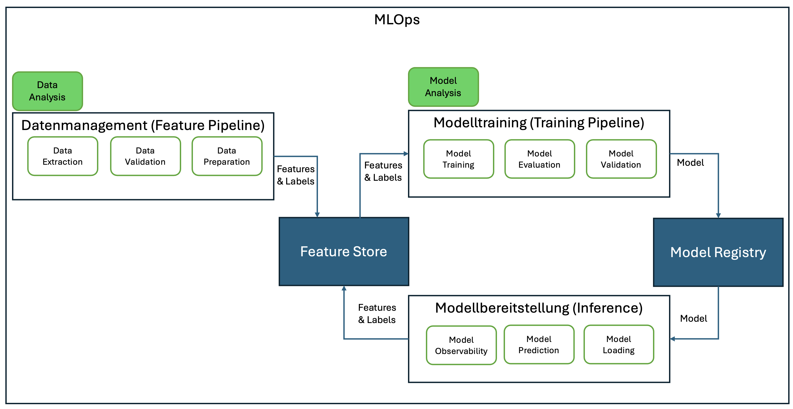

# MLOps

MLOps (Machine Learning Operations) ist eine DevOps-Erweiterung, die effektive Verfahren und Prozesse für die Entwicklung, Erstellung und Bereitstellung von ML-Modellen in der Produktion einführt.

Quelle: [MLOps: An Introduction](https://cd.foundation/blog/2020/05/29/mlops-an-introduction/)

## LLMOps

**LLMOps** (Large Language Model Operations) Spezialisierung von MLOps. LLMOps konzentriert sich auf die Herausforderungen und Anforderungen der Verwaltung von LLMs, dabei wird großes Augenmerk auf die besonderen Merkmale von LLMs wie ihre Größe, ihre komplexen Trainingsanforderungen und ihren hohen Rechenbedarf gelegt.

LLMOps umfasst eine Reihe von Aktivitäten, darunter:

- Datenmanagement: Auswahl und Vorbereitung von Trainingsdaten sowie Überwachung und Aufrechterhaltung der Datenqualität
- Modelltraining und -optimierung: LLMs trainieren und optimieren, um ihre Leistung bei bestimmten Aufgaben zu verbessern
- Modellbereitstellung und -wartung: Bereitstellung und Verwaltung von LLMs auf KI-Plattformen
- Monitoring: Tracking der LLM-Leistung, Identifizierung von Fehlern und Optimierung von Modellen
- Sicherheit und Compliance: für die Sicherheit und Einhaltung gesetzlicher Vorschriften des LLM-Betriebs sorgen

Unter der Annahme, dass für die Referenz-Architektur auf vortrainierten Foundation-Modellen aufgesetzt werden kann, alkso keine LLMs von Null auf trainiert werden müssen, liegt der Schwerpunkt innerhalb LLMOps auf:

- Finetunen von LLMs
- Bereitstellen von LLMs (inklusive Compliance-Prüfung)
- Prompt-Monitoring & Versionierung (innerhalb der Observability und Prompt-Management)
- Guardrails (Absicherung der LLMs durch Leitplanken)

## Open-Source MLOps und LLMOps-Tools

- [mlflow](https://mlflow.org/)
- [Pezzo](https://github.com/pezzolabs/pezzo)
