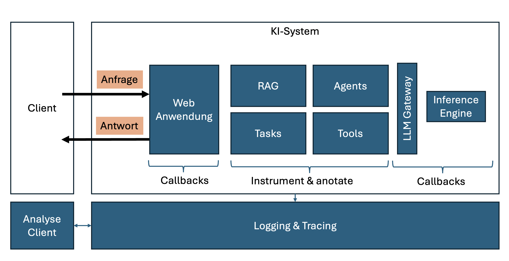
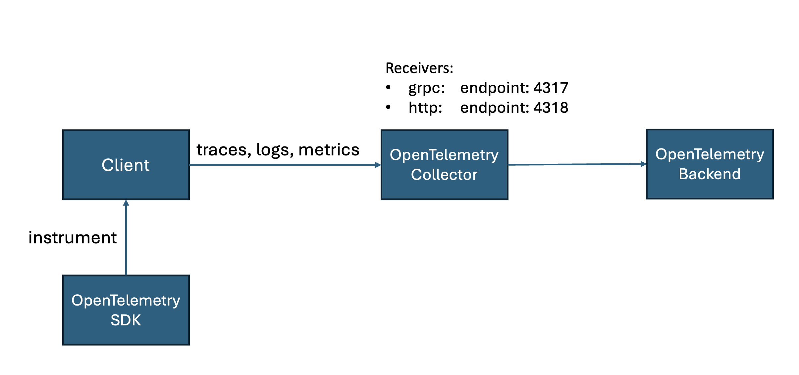

# Observability

Observability von künstlicher Intelligenz ist ein Konzept, das die Fähigkeit beschreibt, die Aktionen von KI-Systemen in realen Umgebungen zu überwachen und zu verstehen.

Ziele von Observability sind:

- Grundlegende Probleme identifizieren
- Qualitäts und Leistung kontinuierlich überwachen und verbessern

Dazu ist es wichtig kontinuierlich Daten zu sammeln und zu analysieren:

- Eingaben (Request)
- Ausgaben (Response)

Dabei ist es relevant nicht nur Eingabe uns Ausgabe zu loggen, sondern auch den internen Status von KI-Systemen zu überwachen und damit zu verstehen wie die Eingabe in die Ausgabe vom KI-System transformiert wird.

Grundsätzlich werden folgende Daten unterschieden:

- Metriken
- Logging-Einträge
- Traces

Aktuell gibt es zwei Ansätze in der Observability. Der erste fokussiert auf das Überwachen eines Systems in der Produktivumgebung. Der zweite fokussiert auf die Entwicklung und die Aufrechterhaltung eines KI Use Cases.

|Fokus| KI-System | KI Use Case |
|-----| --------- | ----------- |
|Traces||Prompt-Tracing|
|Metriken||Prompt-Monitoring: TTFT, TBT, TPS, TPOT|
|||Accuracy, Toxicity, Hallucination Rate|
|||RAG: Relevant und Präzision bezogen auf den gefundenen Kontext|
|Fehler| zur Laufzeit| Ex-Post (Evaluation, User Feddback)|
|Anwendungsfälle| Durchsatz & Latenz | Debug Traces, Anwendungs-Benchmarking, Testen, Monitor Halluzinationen, Evaluierung |
|Rollen| DevOps | Data Scientist, Softwareentwickler|
|Fokus| holistischer Blick auf das System | KI Use Case verstehen |

Ziel ist es einen Observability Stack bereitzustellen, den alle wesentlichen Komponenten der KI Referenzarchitektur nutzen: Frontend, Services, LLM-Gateway und Inference Engines. Dabei werden Instrumentalisierung, Annotation (Dekoration) und Callbacks genutzt.  

## OpenTelemetry

[OpenTelemetry](https://opentelemetry.io) ist eine open source Initiative, die eine Sammlung von APIs, SDKs und tools als Observability Framework bereitstellt, um standardisiert zielgerichtete Observability zu ermöglichen.

Damit können dann Telemetrie Daten (Logs, Metriken, Traces) instrumentarisiert, erzeugt, gesammelt und exportiert werden, um die Performanz und das Verhalten von Software zu analysieren.

Aktuell ist ein Projekt in Gange, das innerhalb von OpenTelemetrie  [Generative AI Observability](https://github.com/open-telemetry/community/blob/main/projects/gen-ai.md) standardisiert.

## Metriken

### Prompt-Monitoring

- Time to First Token (TTFT)
- Time between Tokens (TBT)
- Tokens per Second (TPS)
- Time per Output Token (TPOT)
- Total Latency (Gesamtzeit, die benötigt wird, um einen Anfrage-Antwort-Zyklus abzuschliessen)

### RAG-Metriken ([ragas](https://docs.ragas.io/en/stable/concepts/metrics/available_metrics/))

- Context Precision
- Context Recall
- Response Relevancy
- Faithfulness

## Open Source KI Observability Tools und Metrik-Suiten

Im folgenden unterscheiden wir zwischen OpenTelemetry Observability Tools und Metrik-Suiten. 

### Open Source KI Observability Tools

- [Langfuse](https://langfuse.com)
- [Pydantic Logfire](https://logfire.pydantic.dev/docs/)
- [Lunari](https://github.com/lunary-ai/lunary)
- [OpenLit](https://openlit.io)
- [OpenLLMetry](https://github.com/traceloop/openllmetry)

#### OpenLit

Openlit benennt sich selbst als Open Source Plattform (Apache 2.0 Lizenz) für AI Engineering. Enthalten sind neben OpenTelemetry-nativer Observability auch ein GPU Monitoring, ein Ansatz für Guardrails, sowie ein Prompt Management und ein Playground.

Openlit unterstützt das Experimentieren mit LLMs, die Organisation und die Versionierung von Prompts.

Die OpenTelemetry-native Observability hat den Fokus auf Ende-zu-Ende Monitoring inklusive LLMs, Vektor Datenbanken, RAG & Agent Frameworks und GPUs.

Openlit folgt den [Semantic Conventions von OpenTelemetry](https://github.com/open-telemetry/semantic-conventions/tree/main/docs/gen-ai).

#### OpenLLMetry

OpenLLMetry ist eine Open Source (Apache 2.0 Lizenz) Erweiterung von OpenTelemetry für LLM-Anwendungen. Da es unter der Haube OpenTelemetry verwendet, kann an an beliebige Observability-Lösungen, welche auf OpenTelemetry aufseten angeschlossen werden.

#### Langfuse

Langfuse ist eine Open Source Engineering Plattform für das Tracen und Evaluieren von LLM-Anwendungen. Es unterstützt zusätzlich durch ein Prompt-Management. Langfuse ist zwar Open Source, aber nur bedingt [frei](https://github.com/langfuse/langfuse?tab=License-1-ov-file#readme) nutzbar. Teile von Langfuse stehen unterliegen einer kommerziellen Lizenz.

Langfuse kann it und ohne OpenTelemetry Unterstützung verwendet werden.

### Metrik-Suiten

- [ragas](https://github.com/explodinggradients/ragas)
- [deepeval](https://github.com/confident-ai/deepeval)

## Anbindung Guardrails

Guardrails können an mehreren Stellen in der Referenzarchitektur eingebunden werden, entweder als Pipe direkt in der Chat-Anwendung oder Im LLM-Gateway.
