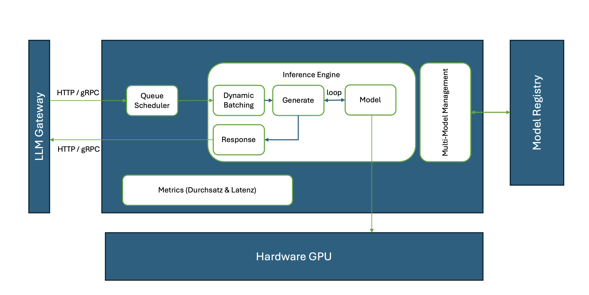

# Inference

## Server und Engine

Die Nutzung eines Modells (LLMs) zur Inference kann gtundsätzlich in zwei Komponenten unterteilt werden: Die Inference Engine und der Inference Server. Die Inference Engine kümmerts sich um das Laden des Modells, den Aufruf des Modells zur Next-Tolken-Prdiction , sowie das das Stapeln der Anfragen (Batching), während der Inference Server die Weiterleitung der Benutzeranfragen übernimmt.

Die Inference Engine kann eine Vielzahl von Optimierungstechniken unterstützen. Im Kern handelt es sich um Python- oder C++-Bibliotheken. Sie sorgen für das Stapeln der Anfragen (Batching), die von den Benutzern an unseren Chatbot gerichtet werden, und für die Generierung der Antworten auf diese Anfragen.

Der Inference Server übernimmt die Orchestrierung der HTTP/gRPC-Anfragen, die von den Benutzern eingehen. Die Server nehmen die Benutzer-Anfragen entgegen und stellen sie in die Warteschlange, bis sie sie an die Engine weiterleiten, die dann die Antwort generiert.

Anmerkung: Einige LLM-Gateways fungieren als Server.

## Metriken

Es gibt zwei wesentliche Metriken, die unser Verständnis von der Leistung des Systems und der Benutzererfahrung prägen. Das sind Durchsatz und Latenz. Diese werden in der Regel vom Server gemessen und zurückgeliefert.

|Metrik|Auswirkung|
|---------|--------|
|Latenz| Latenz spiegelt die Zeit wider, die der Server und das Modell benötigen, um die vollständige Ausgabe in der Ausgabesequenz zu erzeugen. Wenn wir die erzeugte Ausgabe an den Endbenutzer streamen, bezieht sich die Latenz speziell auf die Zeit, die der Inferenzserver benötigt, um das allererste Token zu erzeugen. Diese Zeit für die Erzeugung des ersten Tokens wird auch als „time to first token“ (TTFT) bezeichnet. |
||Die Latenz ist das, was der Benutzer spürt - die Zeit, die er braucht, um eine Antwort vom Chatbot zu erhalten.|
|Durchsatz|Der Durchsatz gibt an, wie viele Nutzer unser System effektiv bedienen kann. Der Durchsatz steht für die Anzahl der vom Inferenzserver pro Sekunde generierten Token während der zahlreichen Anfragen der Benutzer. Je höher der Durchsatz ist, desto besser kann unser System auf Benutzeranfragen eingehen und reagieren.|
||Beim Durchsatz geht es nicht nur darum, wie viele Benutzer unser System effektiv gleichzeitig bearbeiten kann, sondern er wirkt sich auch auf die Benutzererfahrung im Stream-Modus aus - die Benutzer spüren die Geschwindigkeit, mit der neue Wörter generiert werden.|

## Auf was solle man achten

Bei der Auswahl von Inference Server und Inference Engine sind folgende Eingenschaften relevant, die sich auf Durchsatz und Latenz auswirken:

Inference Engine:

- Speicher-Management (KV-Cache): FIFO und Speicherreservierung 
- Stapelverarbeitung von Anfragen (Batching)
- Modellspezifische Optimierung (Paged Attention)

Inference Server:

- HTTP/gRPC-APIs: z.B. OpenAI API
- Verwaltung der Anfrage-Warteschlangen (Queuing)
- Multi-Modell-Unterstützung
- Multi-Engine-Unterstützung

## Gängige Inference Server / Engines

Open-Source (und Open-Weight) Modelle können in unterschiedlichen Binärformaten vorliegen:

- PyTorch Format: PyTorch-Modellgewichte werden mit dem Pickle-Dienstprogramm von Python in einer bin-Datei gespeichert.
- Safetensors Format: [Safetensors](https://github.com/huggingface/safetensors) ist ein von Hugging Face entwickeltes sicheres und schnelles Dateiformat zum Speichern und Laden von Tensoren.
- Quantisierte Modelle: GGUF

Nicht jede Inference Engine kann jedes Modell Speicher-Format verwenden.

### Ollama

[Ollama](https://ollama.com) ist ein in Go OpenAI kompatibler Server, der die Inference Engine [llama.cpp](https://github.com/ggerganov/llama.cpp) nutzt. llama.cpp ist eine in C/C++ geschriebene Inference Engine. llama.cpp kann Modelle ausführen, weclhe im [GGUF](https://github.com/ggml-org/ggml/blob/master/docs/gguf.md) Dateiformat vorliegen. GGUF ist ein binäres Dateifomat für Inference mit der Tensor-Bibliothek für maschinelles Lernen [GGML](https://github.com/ggml-org/ggml).

### llama-cpp-python

Die Python-Bindings [llama-cpp-python](https://llama-cpp-python.readthedocs.io) für llama.cpp stellen ebenfalls einen  OpenAI API kompatiblen Web-Server zur Verfügung.

### vLLM

[vLLM](https://docs.vllm.ai/en/latest/)

Literature:

- [Which serving technology to choose for LLMs](https://pages.run.ai/hubfs/PDFs/Serving-Large-Language-Models-Run-ai-Benchmarking-Study.pdf)
