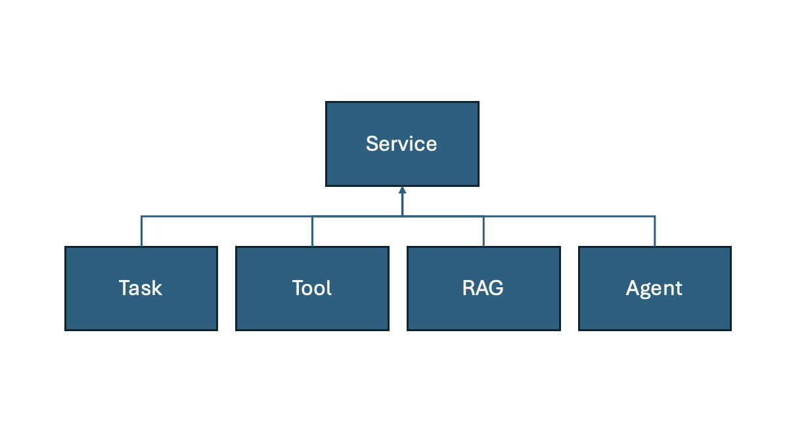
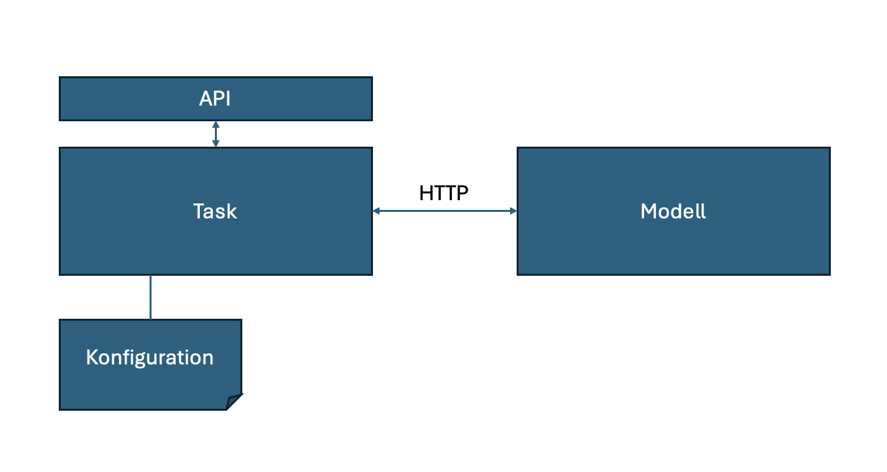
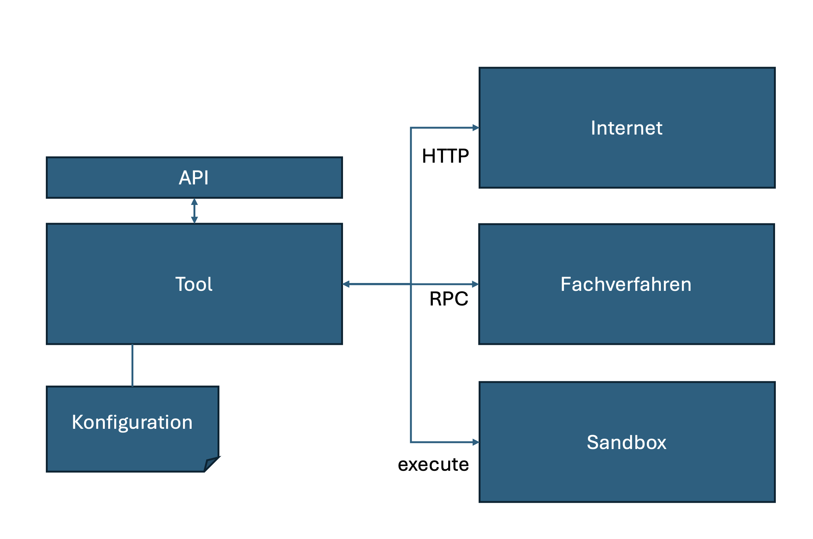
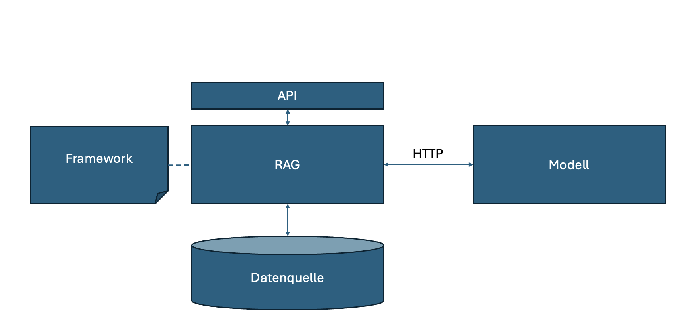
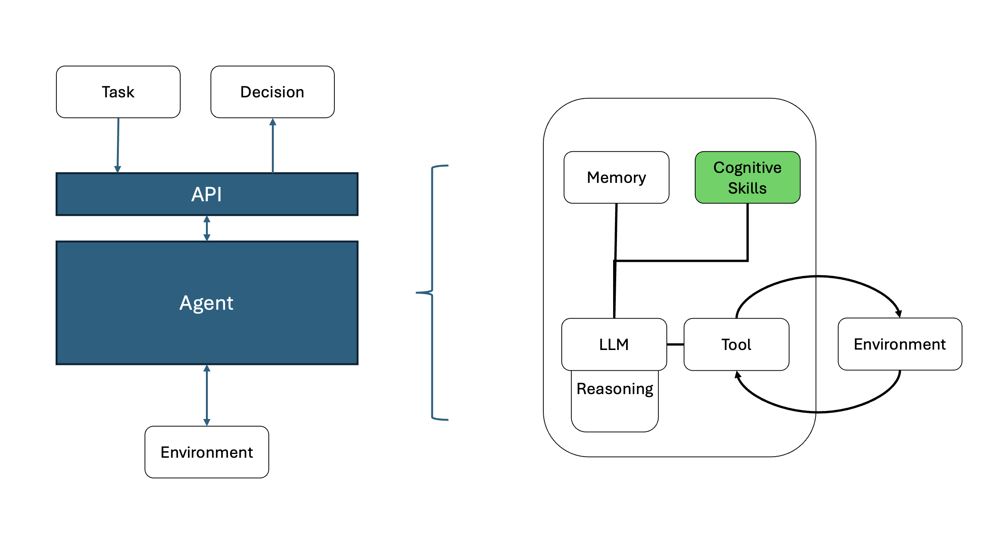

# Services

Services sind zustandslose funktionale Bausteine die sich zu Use Cases kombinieren lassen. Ziel ist es, diese für die unterschiedlichen Use cases der öffentlichen Verwaltung wiederzuverwenden. Um dieses Ziel zu erreichen ist es notwendig, die Services nach einheitlichen Standards zu entwickeln, sie mit einem API zu versehen (über das sie gleichartig aufgerufen werden können) und als containerisierte Komponenten auszuliefern.

Wir unterscheiden vier Service Typen:

## Task

Ein Task ist ein Model-Task-driven Service. Hierbei wird eine spezifische Aufgabe mit einem spezifischen Modell ausgeführt. Dabei ist das Modell für die Aufgabe optimiert. Die Optimierung kann durch verschiedene Arten des Trainings (Supervised Finetuning, Reinforcement Learning, ..) erfolgen.

Ein Vielzahl von Model-Tasks und geeignete Modell finden sich auf [Hugging Face](https://huggingface.co/tasks).

Eine große Anzahl der in den Anforderungen beschriebenen Use Cases, wie z. B. Text Manipulationen oder Translationen, lassen sich mit einem geeigneten Modell als Tasks umsetzen.

## Tool

Ein Tool ist ein Service mit dem das System mit seiner Außenwelt (seinem Environment) interagieren kann. Im Gegensatz zu Tasks haben Tools keinen Zugriff auf ein Modell, dafür aber auf das Environment des Systems.

Typische Environments sind das Internet, Fachverfahren, aber auch eine Sandbox, in der Code ausgeführt werden kann.

### Sandbox

Die sichere Ausführung von durch ein LLM erzeugten Code sollte entweder auf einer isolierten virtuellen Maschine oder über ein externes API (z.B. [E2B](https://e2b.dev)) erfolgen.

### MCP Server

Mithilfe des Model Context Protokolls (MCP) lassen sich verschiedene Datenquellen (Ressourcen, Tools, Templates) standardisiert an KI-Anwendungen anbinden. Die Kommunikation erfolgt dabei bidirektional, so dass Datenquellen von einer KI-Anwendung gezielt angesprochen werden können, um bestimmte Informationen bereitzustellen. Diesen Zweck erfüllen MCP-Server, welche die Implementierung der Datenbereitstellung beinhalten. Die Anbindung von Tools kann somit über das Model Context Protokoll (MCP) standardisiert werden.

## Retrieval-Augmented-Generation

Retrieval-Augmented-Generation (kurz RAG ist ein komplexer Service, bei dem zu einem Prompt (Anfrage des Benutzers) Wissen aus vorhandenen Datenquellen selektiert, von dem man ausgeht, dass es als Faktenwissen in einem LLM nicht vorhanden ist. Der Prompt wird um das selektierte Wissen erweitert. Sowohl für das Retrieval, als auch für das Augmentation gibt es zahlreiche Umsetzungsmuster, die innerhalb eines RAG angewandt werden können, um das gewünschte Ergebnis zu erzeugen.

Als Datenquellen werden je Aufgabe Vektor-Datenbanken, Graphen-Datenbanken, SQL-Datenbanken und Indexe (BM25) eingesetzt. Der Einsatz eines RAG bedingt einer vorgelagerten Data-Pipeline, mithilfe derer man das Wissen geeignet aufbereitet in die ausgewählte Datenquelle überführt.

RAG hat sich in den letzten zwei Jahres von einer einfachen Suche basierend auf Vector-Similarity (semantische Ähnlichkeit zwischen Text-Chunks) hin zu komplexeren Grafen-basierten Verfahren weiterentwickelt.

### Kandidaten für die Implementierung

|RAG|Lizenz|Einsatzzweck|Skalierbarkeit|
|---|----|------------------|--|
|[GraphRAG](https://microsoft.github.io/graphrag/) [Arxiv](https://arxiv.org/pdf/2404.16130)|MIT Licence       |Produktion|--|
|Idee:|GraphRag basierte Ansätze nutzen strukturiertes Wissen. Dazu muss das Wissen im Vorfeld aus den Daten extrahiert und in Form eines Wissensgraphen aufbereitet werden. Auf einen Wissensgraphen gespeichert in einer Graphendatenbank kann mittels Cipher-Abfragen zugegriffen werden. Hierzu muss die vom Nutzer des RAG gestellte Frage mittels LLM in eine geeignete Cipher-Abfrage umgewandelt werden. Das bedeutet, dass aus der Frage des Benutzers Entitäten und Beziehungen extrahiert werden, um damit in die Wissensdatenbank zu suchen. GraphRag setzt zusätzlch das Leiden Community Detection Clustering-Verfahren ein, um Knoten im Wissengraphen zu clustern. Auf diese Weise werden zusätzliche Knoten erzeugt, welche mit einer Zusammenfassung versehen werden. Dies ermöglicht sowohl eine lokale Suche (Knoten im Wissensgraph) als auch eine globale Suche (Cummunities).|Vor- und Nachteile: GraphRags neigen zu Information-Overflow, also zu viele Informationen als Antwort zu liefern. Zudem ist die Aufbereitung des Wissensgraph in der Regel ein kostspieliger Prozess. Von Vorteil ist, dass die Aufbereitung inkrementell erfolgen kann.||
|[LigthRAG](https://github.com/HKUDS/LightRAG) [Arxiv](https://arxiv.org/pdf/2410.05779)|MIT Licence|Vor-Produktion||
|Idee:| LightRAG implementiert einen Index-Graph (als Wissensgraph), um damit die Performanz zu verbessern. In einem Deduplication-Schritt werden zudem redundante Knoten und Kanten zusammengeführt. Durch die Kombination von Graphenstrukturen mit Vektordarstellungen wird ein tieferen Einblick in die Zusammenhänge zwischen den Entitäten gewährt. Dies ermöglicht es dem Suchalgorithmus, sowohl lokale als auch globale Schlüsselwörter effektiv zu nutzen. Dadurch wird der Suchprozess effizienter und die Relevanz der Ergebnisse verbessert.|||
|[Haystack (deepset-ai)](https://github.com/deepset-ai/haystack) |Apache License 2.0|Produktion|Ausgelegt für die Bearbeitung großer Dokumentenbestände|
|Idee:|Haystack ist ein RAG-Framework, das Abfragen, Einbettungsmodelle und LLMs orchestriert. Der primäre Fokus liegt auf hoch performanten Suchsystemen.|||
|[RAGFlow (infiniflow)](https://github.com/infiniflow/ragflow)   |Apache License 2.0|--        |--|
|[txtai (neuml)](https://github.com/neuml/txtai)                 |Apache License 2.0|Produktion|--|
|[STORM](https://github.com/stanford-oval/storm) [Arxiv](https://www.arxiv.org/pdf/2408.15232)|MIT Licence       |Vor-Produktion|--|
|Idee:|STORM ist ein System, das Wikipedia-ähnliche Artikel auf der Grundlage einer Internetsuche von Grund erstellt. Co-STORM hat seine Funktion um ein kollaboratives System verbessert.|||
|[R2R](https://github.com/SciPhi-AI/R2R)                         |MIT Licence       |Produktion|--|
|[LangChain](https://github.com/langchain-ai/langchain)          |MIT Licence       |Produktion|eingeschränkt|
|Idee:|Das primäre Ziel von LangChain ist es, die Entwicklung komplexer LLM-Anwendungen zu vereinfachen. Es verfolgt einen modularen Ansatz und basiert auf sogenannten Chains (Ketten), die weitgehend dem Pipe & Filter Muster genügen.|||
|[LlamaIndex](https://github.com/run-llama/llama_index)          |MIT Licence       |Produktion|--|
|Idee:|Das primäre Ziel von LlamaIndex ist es den Indexing-Prozess zu optimieren. Also das Chunken und Einbetten von Text mittels Einbettungsmodellen und Vektordatenbanken.|||

## Agent

Ein Agent ist ein Service, der autonom oder semi-autonom eine Aufgabe erfüllt. Die Aufgaben-Steuerung kann entweder durch eine SOP (Standard Operating Procedure) vorgegeben werden oder mittels LLM in einem Planungs-Task erzeugt werden. Ein Agent kann sich dann je nach Aufgabe anderer Services bedienen. 

[Vertikale Agenten](https://arxiv.org/abs/2501.00881) sind spezialisierte Agenten die neben dem LLM, das zur Aufgaben-Steuerung verwendet wird zusätzlich über ein Kurzzeit-Gedächtnis, geeignete Tools (mit dem sie ihre Außenwelt verändern können) und weitere kognitive Fähigkeiten verfügen.

KI-Agenten-Frameworks können anhand zwei unterschiedlichen Kriterien bewertet werden:

1. Grad an Abstraktionsschichten auf denen sie aufbauen
2. Automatisierungs-Autonomie. Wie stark werden Arbeitsabläufe vorgegeben bzw. dürfen diese durch das LLM bestimmt werden.

Im Folgenden wollen wir zwischen Agenten Frameworks, welche den Fokus auf den Agenten legen und die Steuerung bzw. Collaboration der Agenten unterscheiden.

|Agent|Lizenz|Einsatzzweck|Skalierbarkeit|
|-----|------|------------|--------------|
|[Pydantic AI](https://ai.pydantic.dev)|MIT Licence|Produktion||
|Idee:|Während Pydantic als Validation Layer von OpenAI SDK, Anthropic SDK, LangChain, LlamaIndex, AutoGPT, Transformers, CrewAI, Instructor und weiteren Frameworks verwendet wird, erweitert Pydantic AI seinen ZType-checking Mechanismus auf Agenten.|||
|Idee:|Die Abstraktionen des Frameworks sind auf ein Minimum reduziert.|||
|[smolagents](https://github.com/huggingface/smolagents) [Hugging Face](https://huggingface.co/docs/smolagents/index)|Apache License 2.0|Produktion||
|Idee:|Die Abstraktionen von smolagents sind auf ein Minimum reduziert. Das Framework liefert bereits spezialisierte Agenten und Tools|||

## Collaboration

|Collaboration|Lizenz|Einsatzzweck|Skalierbarkeit|
|-----|------|------------|--------------|
|[AutoGen](https://microsoft.github.io/autogen/0.2/) [Github](https://github.com/microsoft/autogen)|CC-BY-4.0 Licence, MIT License|Produktion||
|Idee:|AutoGen ist ein Multi-Agenten Framework|||
|[n8n](https://n8n.io) [GitHub](https://github.com/n8n-io/n8n)||Produktion|--|
|Idee:|AI Workflow-Automation|||
