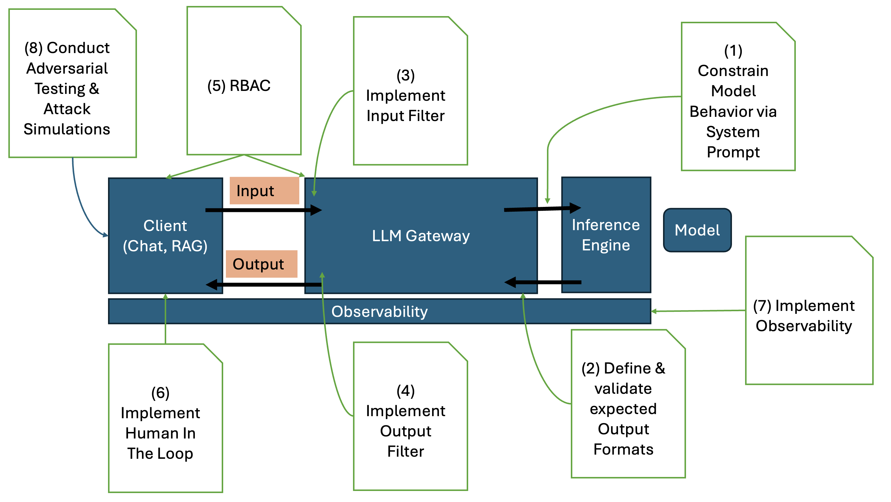

# Sicherheits-Anforderungen

Das [Open Worldwide Application Security Project (OWASP)](https://owasp.org/about/) beschreibt [10 Risiken beim Einsatz von LLMs und GenAI Anwendungen](https://genai.owasp.org/llm-top-10/) und gibt Anleitungen zur Mitigation dieser Risiken:

1. Prompt Injection
2. Sensitive Information Disclosure
3. Supply Chain
4. Data and Model Poisoning
5. Improper Output Handling
6. Excessive Agengcy
7. System Prompt Leakage
8. Vector and Embedding Weaknesses
9. Misinformation
10. Unbound Consumption

Eine KI-Plattform für die öffentliche Verwaltung sollte geeignete Maßnahmen für die Mitigation diese Risiken bereitstellen:

## Prompt Injection

Direkte Prompt Injection tritt auf, wenn die Prompt-Eingabe des Benutzers das Verhalten der GenAI Anwendung  (oder des dahinterliegenden Modells) auf unbeabsichtigte oder unerwartete Weise direkt verändert. Dabei kann die Eingabe entweder beabsichtigt oder unbeabsichtigt erfolgt sein. Dem gegenüber steht die indirekte Prompt Injection. Diese tritt auf, wenn die Eingabe über externe Quellen (Services, Tools) beeinflusst werden.

Die Nachfolgende Grafik zeigt Mitigationsstrategien auf, die im Wesentlichen durch den Einsatz eines LLM Gateway erreicht werden können:

1. Schränke das Verhalten des Modells ein: Über den System Prompt können spezifische Anweisungen über die Rolle, die Fähigkeiten und die Grenzen des Modells erzwungen werden.

2. Validiere Ausgabeformate: Verwende deterministischen Code, um Ausgabeformate zu überprüfen. 

3. Implementiere Input Filter: mittels Guardrails

4. Implementiere Output Filter: mittels Guardrails

5. Implementiere Role-Based Access Control: Das Modell sollte immer mit der Rolle des jeweiligen Benutzers ausgeführt werden. Das gilt auch für RAG und Agenten.

6. Implementiere Human-In-The-Loop Kontrollen: um Nicht-Autorisierte Aktionen zu verhindern.

7. Implementiere Observability entlang der gesamten Ausführungsstrecke

8. Führe regelmäßig Angriffssimulationen durch: Das Modell wird dabei als immer als nicht-vertrauenswürdig eingestuft und seine Zuverlässigkeit überprüft.
